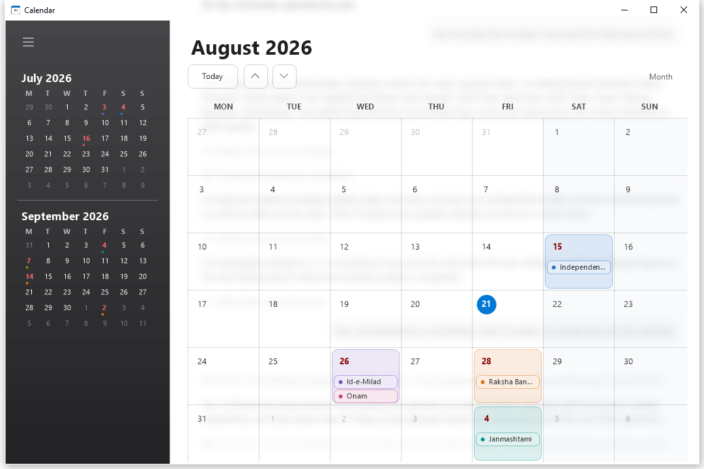
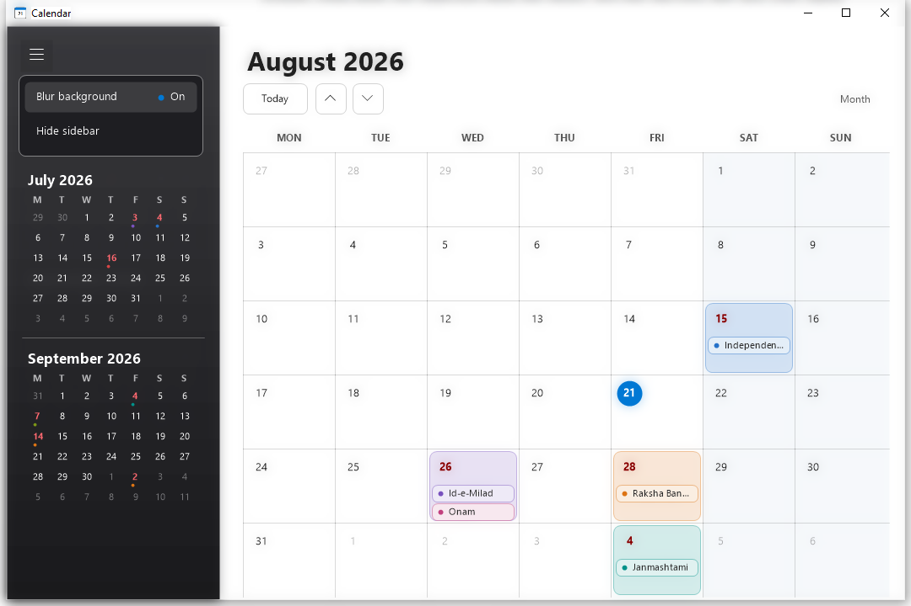

# Simple Calendar for Windows

A lightweight, offline Windows 10 calendar with a real glass background, a compact live tile, and India/USA holiday support. It is built with native Windows and .NET Framework APIs and does not require a third-party runtime, account, network service, or background helper.



## Highlights

- Frosted white glass that reveals and blurs the apps behind the calendar.
- Glossy black sidebar with the previous and next month at a glance.
- Larger bold weekday headings and bold blood-red holiday dates.
- Different accent colors for holiday and festival cards, including multi-event days.
- India national holidays, selected 2026 Hindu/regional festivals, and U.S. federal holidays (including observed weekdays).
- Blur and sidebar controls live inside the hamburger menu.
- Small Windows live tile keeps its centered, medium-weight date design.
- Native Windows system UI font and DPI-aware drawing.
- Fully offline and free of ads or telemetry.



## Download and run

Open the repository's **Releases** page and download the files for version 1.1.2.

### Portable version

Download and run `Simple Calendar.exe`. It needs no installation. Windows live tiles require package identity, so the portable build cannot own the Start-menu live tile.

### Live-tile version

Keep these three files together:

- `Simple Calendar Live Tile.msix`
- `Simple Calendar Certificate.cer`
- `Install Simple Calendar.ps1`

Right-click `Install Simple Calendar.ps1`, choose **Run with PowerShell**, and approve the Windows prompt. The script verifies that the included public certificate is restricted to code signing, imports it to **Local Machine > Trusted People**, installs the MSIX, and opens Calendar. The private signing key is not included.

If needed, find Calendar in Start, choose **Pin to Start**, and resize it to **Small**.

## Build from source

Requirements:

- Windows 10 or later (x64)
- .NET Framework 4.x compiler/developer tools
- Windows 10/11 SDK with WinMD references and `MakeAppx.exe` for optional MSIX packaging

Run:

```powershell
powershell -ExecutionPolicy Bypass -File .\build.ps1
```

Add `-Package` to also create an unsigned MSIX:

```powershell
powershell -ExecutionPolicy Bypass -File .\build.ps1 -Package
```

The executable and package files are written to `dist`. A distributable MSIX must be signed with a certificate whose subject matches `CN=Simple Calendar`. Signing keys are intentionally excluded by `.gitignore`.

## Holiday data

India's fixed national holidays are generated every year. The additional Hindu and regional entries currently cover 2026 and are based on official government holiday lists. Lunar, moon-sighting, and regional observances can vary by location or official announcement. U.S. federal dates are generated from their calendar rules, including observed dates for fixed holidays.

Official references used for the 2026 India entries:

- [ICAR-CPCRI 2026 restricted holidays](https://cpcri.gov.in/filemgr/webfs/download/2026Restricted_Holidays.pdf)
- [CAG Karnataka 2026 holiday list](https://cag.gov.in/uploads/media/Holiday-List-2026-069521fe6f358d0-89936988.pdf)

## Privacy and security

Simple Calendar stores no account data, makes no network requests, has no analytics, and uses no always-running helper. The MSIX installer adds only the included public code-signing certificate so Windows can verify this self-signed community build.

## License

[MIT](LICENSE)
